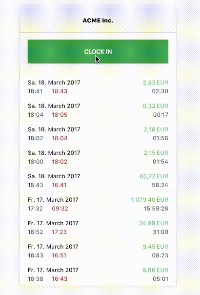

A simple time-tracking-application which can record the times spent on different projects and calculate the earnings
based on this.

## Installation

* Ensure a node version above 7 or if you use [nvm](https://github.com/creationix/nvm),
run `nvm use` and the node-version will be picked up from `.nvrmc`
* Make sure you have [yarn](https://github.com/yarnpkg/yarn) installed
* `yarn run setup` - Switches to correct node-version, installs dependencies and runs tests to ensure correct setup
* Rename `.env.sample` to `.env` and switch `REACT_APP_STORAGE_TYPE` to `localStorage` or if you want to use your
own firebase setup skip to the next section
* `yarn start` - Starts server and client

### Use Firebase
* Firebase authentication is currently virtually non-existent, as the app is configured to just login everybody as the
user "me" via custom authentication when the app is opened. For more info about the reasons see the
"What you might wonder"-section below.
* To setup your own Firebase-Back-End, you need:
    * A firebase account with a new firebase project
    * Click the `Add firebase to your web app`-button on the first screen after project creation
    * Use the displayed settings to fill out the corresponding values starting with `REACT_APP_FB_` in the `.env`-file
        you created by copying it from `.env.sample` as mentioned above
    * Go to `https://console.firebase.google.com/project/_/settings/serviceaccounts/adminsdk` and select the project
        you just created
    * Click on `Generate new private key`
    * Copy the downloaded file to the `server` folder as `auth.json`. You will find a `auth.json.sample` in the place
        where it is supposed to go
    * In `.env` set the key `REACT_APP_STORAGE_TYPE` to `firebase`

## Motivation

* This is a side-project which demonstrates some of my current approaches of developing and designing front-end-applications.
There is additional documentation about the decisions that were made regarding technologies, application design and architecture
in the format of [Architecture Decision Records](http://thinkrelevance.com/blog/2011/11/15/documenting-architecture-decisions) in the `docs`-folder.
Please feel free to explore.
* IMHO you get the best results in UI and UX if the people working on the app use it on a daily basis. So this is what
I use to track the time I spend on different projects.
* My preferred way of learning new technologies is constantly rewriting the same set of applications. This is one of them.

## Next steps
* Add multi-user capabilities along, which will require real authentication
* Make entries editable
* Turn it into a Progressive Web App, for better offline and mobile-support
* Implement statistics
* SSR
* Prepack

## What you might wonder
* Authentication is not meant to be real as the user is logged in without any credentials right now. This
is a one-user-app at the moment. In production it is installed into a non-public system that employs
its own access-control, which allows for this shortcut. If this where a multi-user-app, real user-management and
a login procedure would be in place.

## Credits
* "Time"-Icon in logo created by Richard de Vos for "The Noun Project", https://thenounproject.com/term/time/6732
* "Arrow"-Icon created by Vladimir Belochkin for "The Noun Project", https://thenounproject.com/term/time/890460
* "Back"-Icon created by Rohit Kumar for "The Noun Project", https://thenounproject.com/term/time/636001
* "Plus"-Icon created by Setyo Ari Wibowo for "The Noun Project", https://thenounproject.com/term/time/991603/
* "Skull"-Icon created by Giuditta Valentina Gentile for "The Noun Project", https://thenounproject.com/term/time/301856

Thank you for your work!
